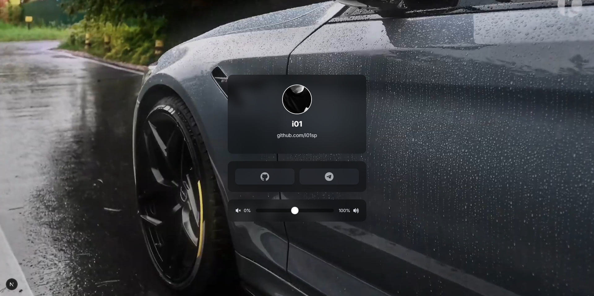

# BiolinkPerso

<div align="center">
  


</div>

## Aperçu

<div align="center">
  
</div>

## Démarrage

```bash
# Installer les dépendances
npm install

# Lancer en développement
npm run dev
```

## Personnalisation

- **Profil** : Remplacez `/public/images/i01.jpg`
- **Vidéo** : Ajoutez votre vidéo dans `/public/videos/`
- **Liens sociaux** : Modifiez `socialLinks` dans `src/app/page.tsx`
- **Icônes** : Ajoutez vos icônes WebP dans `/public/icons/`

---

<div align="center">
Made with ❤️
</div>
